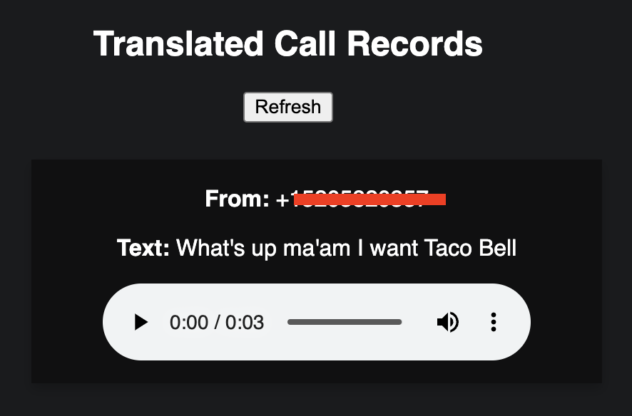

# SignalWire React Relay Translate and Transcribe Example



## Prerequisites

To run this example you will need to first create a SignalWire account and then configure a SignalWire Space with an inbound phone number.

- [Create a SignalWire Space](https://developer.signalwire.com/apis/docs/signing-up-for-a-space)
- [Buy a SignalWire Phone Number](https://developer.signalwire.com/apis/docs/buying-a-phone-number) 


## API Credentials

To run the example a SignalWire Project ID and API Token are required.
[Follow these intructions to create a new API Token.](https://docs.signalwire.com/topics/relay/#relay-documentation-security)

## Configure SignalWire Phone Number to a context

Set the Relay context that your phone number forwards to as `translator`

## Google Speech and Translate

To access the Google Speech to text and language translation API, you need to create an account and some credentials.

Follow these instructions https://cloud.google.com/speech-to-text/docs/libraries
Be sure to include permissions for the translation API as well.

Upon completion you will have downloaded a JSON file with your google key.

Save this file to in the backend directory as `google-key.json`

## Create Environment file

Create a file `.env` with the following contents

```
SIGNALWIRE_PROJECT_KEY=
SIGNALWIRE_TOKEN=
VERIFIED_NUMBER=<Your signalwire phone number including the region code>
GOOGLE_APPLICATION_CREDENTIALS=google-key.json
```

## Running the backend locally

Ensure your `google-key.json` and `.env` file are in this directory and correctly configured with your credentials and SignalWire Phone number.

1. Navigate to the backend directory in a terminal. `cd /backend`
2. Run NPM install. `npm i`
3. Start the backend server and consumer.
```bash
node consumer.js
```

## Running the frontend locally

If you're running your backend remotely, run with the environment variable API_URL set to the remote API address.

1. Navigate to the frontend directory in a terminal. `cd /frontend`
2. Run NPM install. `npm i`
3. Start the frontend
```bash
npm start
```

